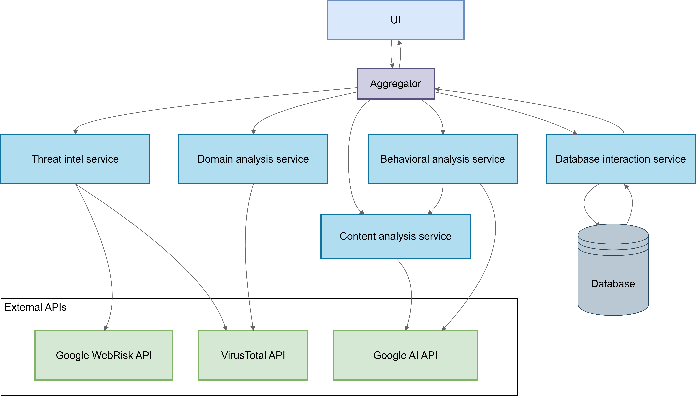

# Phishing Detection System
AI-powered microservice platform for multi-layer phishing detection and risk scoring.

## Problem
Modern phishing websites bypass traditional blacklist-based detection by:
-   Using newly registered domains
-   Rendering malicious content dynamically
-   Triggering payloads only after user interaction
-   Mimicking trusted brands with high semantic similarity
    
Static URL checks are insufficient. This system performs threat intelligence, domain analysis, LLM-based content inspection, and behavior simulation, then aggregates results into a unified risk score.

----

## Architecture
Microservice-based system orchestrated via Docker Compose:

    services/
        threat_intel
        domain_analyzer
        content_analyzer
        behavior_analyzer
        history_service
        risk_aggregator
        ui_service` 

### Core Flow

1.  UI receives URL
2.  Risk Aggregator triggers service calls
3.  Results are combined into weighted risk score
4.  Data is cached in PostgreSQL
5.  Final breakdown is returned to UI

## Services

| Service           | Description                                                                                                                                                                                                                                                                   |
| ----------------- | ----------------------------------------------------------------------------------------------------------------------------------------------------------------------------------------------------------------------------------------------------------------------------- |
| threat_intel      | External reputation analysis. Google Web Risk API, VirusTotal API, URL threat categories, reputation-based scoring.                                                                                                                                                           |
| domain_analyzer   | Domain-level inspection. Domain reputation analysis and reputation-based scoring.                                                                                                                                                                                             |
| content_analyzer  | LLM-based semantic phishing detection. Selenium HTML extraction, screenshot capture, LLM analysis of social engineering patterns, credential harvesting forms, brand impersonation, urgency/manipulation signals. Adds semantic intelligence beyond signature-based systems.  |
| behavior_analyzer | Dynamic phishing detection via user simulation. LLM-generated user behavior, automated clicks and form interactions, redirect tracking, DOM change monitoring, recursive depth control. Triggers re-analysis on significant DOM mutation. Detects interaction-based payloads. |
| risk_aggregator   | Central orchestration and scoring engine. Partial-result tolerance, dynamic weight rescaling, recursive child URL traversal. Weights configurable via environment variables.                                                                                                  |
| history_service   | Persistence and caching layer. PostgreSQL, expiration-based caching, result reuse, cascading cleanup. Tables: urls, domains, threat_intel_results, content_analyzer_results, behavior_actions, behavior_summary.                                                              |
| ui_service        | Streamlit-based frontend. URL submission, risk visualization, service-level breakdown.                                                                                                                                                                                        |

## Technologies

Core:
-   Python
-   Docker / Docker Compose
-   REST APIs
-   PostgreSQL
    
AI and Automation:
-   Google AI (LLM API)
-   Prompt engineering
-   Selenium
-   Headless Browser Automation
-   DOM Analysis

----

## Running the Project

### 1. Configure environment

Create `.env` from: `.env.example` 

Add API keys (WEBRISK_API_KEY, VT_API_KEY,  GOOGLE_AI_API).

Edit (as necessary):
-   Database credentials
-   Risk weights
-   Depth limits
    
### 2. Start services

`docker-compose up --build` 

### 3. Access UI

`http://localhost/`

## Example

Example of analyzing a phishing site with a redirect from the PhishTank database

